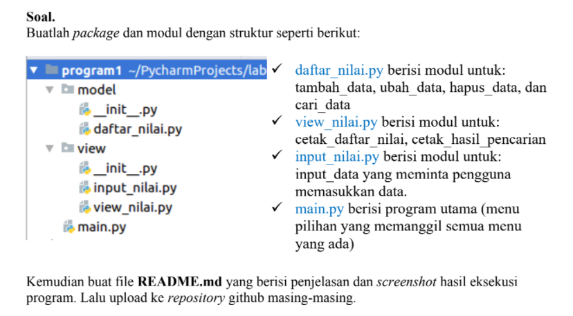
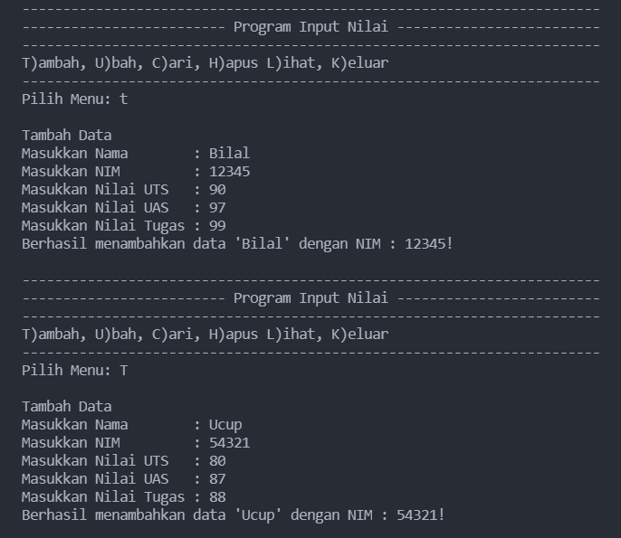
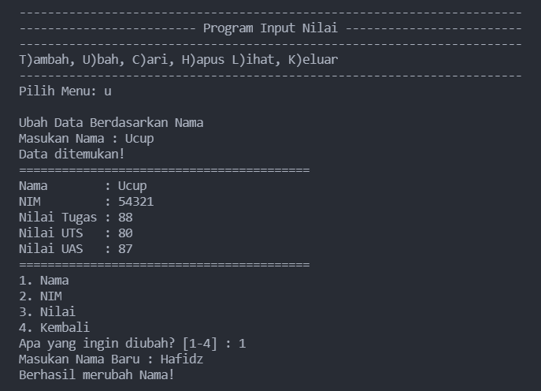
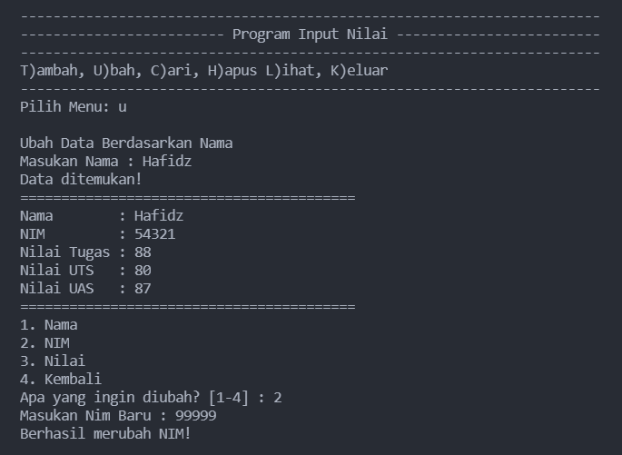
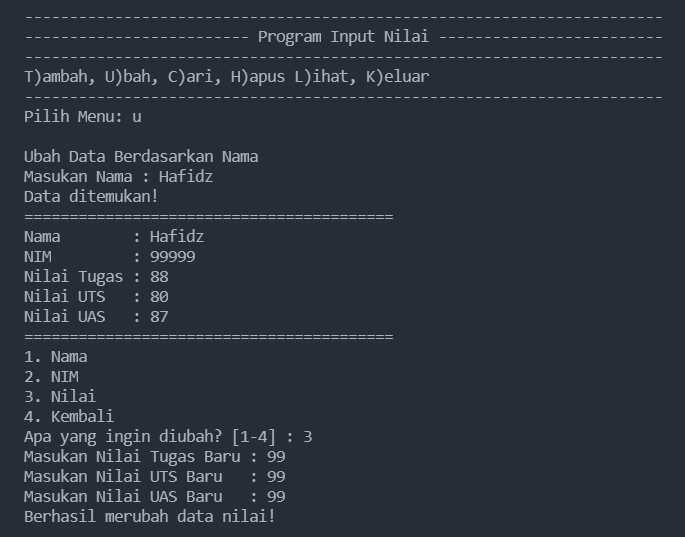
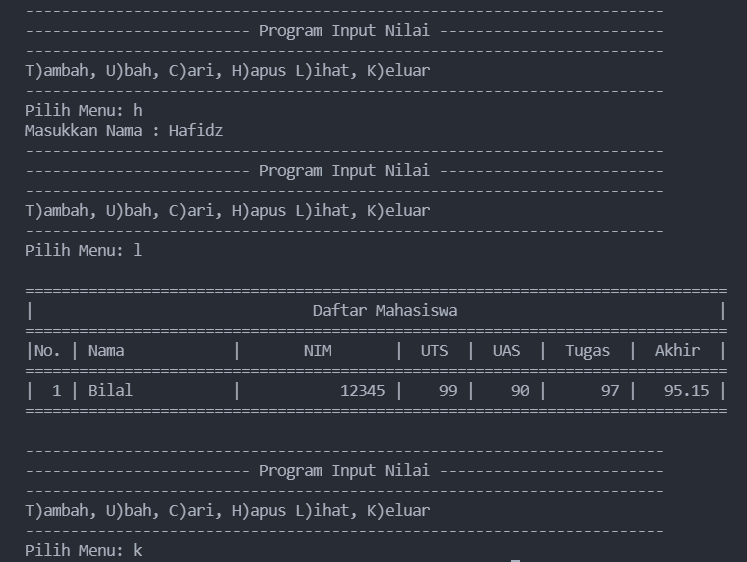

# Pertemuan 16

Konsep Program:



## Penjelasan:

- Pada direktori model terdapat program `daftar_nilai.py` yang berisi modul untuk tambah_data, ubah_data, hapus_data, dan cari_data, dan pada direktori view terdapat 2 program yaitu `input_nilai.py` dan `view_nilai.py` yang berisikan modul untuk input_data yang meminta pengguna memasukan data dan berisi modul untuk cetak_daftar_nilai dan cetak_hasil_pencarian. Terakhir program `main.py` yang berisi program utama (menu pilihan yang memanggil semua menu yang ada). keempat program tersebut akan berhubungan menggunakan `from ... import *` kode program itu berfungsi agar kita dapat memanggil file lain di dalam satu module yang berbeda.

### input_nilai.py

- Membuat modul input_data, yang berisi variable `nama`, `nim`, `tugas`, `uts`, `uas`, dan `akhir` menggunakan variable global dan juga menggunakan statement try and except. agar ketika pengguna melakukan kesalahan program itu tidak akan error secara tidak wajar
```python
def input_nama():
    global nama
    while True:
        nama = input("Masukkan Nama        : ") 
        if nama == "":
            print("Nama Tidak Boleh Kosong!\n")
            print("Masukan Nama dengan Benar")
        else:
            return nama


def input_nim():
    global nim
    while True:
        try:
            nim = int(input("Masukkan NIM         : "))
            if nim == "":
                print("NIM Tidak Boleh Kosong!")
        except ValueError:
            print("\nMasukan NIM Dengan Angka")
        else:
            return nim

    ...
```

### daftar_nilai.py

- Membuat Class dengan nama `data_mahasiswa` yang menggabungkan parameter dengan variable
```python
class data_mahasiswa():
    def __init__(self, nama, nim, uts, uas, tugas):
        self.nama = nama
        self.nim = nim
        self.uts = uts
        self.uas = uas
        self.tugas = tugas
        hasil_akhir = tugas * 30/100 + uts * 35/100 + uas * 35/100
        self.akhir = hasil_akhir
```

- Membuat variabel dict dengan nama `mahasiswa` dengan nilai kosong
- lalu terdapat function `def tambah_data` yang berfungsi untuk Menambah Data Mahasiswa
```python
def tambah_data():
    print("\nTambah Data")
    nama = input_nama()
    nim = input_nim()
    uts = input_uts()
    uas = input_uas()
    tugas = input_tugas()
    akhir = nilai_akhir()
    mahasiswa[nama] =  [nim, tugas, uts, uas, akhir]
    print(f"Berhasil menambahkan data '{nama}' dengan NIM : {nim}!\n")
```

- Lalu ada function `def ubah_data` yang befungsi untuk Mengubah Data Mahasiswa berdasarkan nama, namun jika nama tidak ada didalam data, maka program akan menampilkan "Nama tidak ditemukan"
```python
def ubah_data():
    print("\nUbah Data Berdasarkan Nama")
    nama = input("Masukan Nama : ")
    if nama in mahasiswa.keys():
        print(f"Data ditemukan!")
        print(41*"=")
        print(f"Nama        : {nama}")
        print(f"NIM         : {mahasiswa[nama][0]}")
        print(f"Nilai Tugas : {mahasiswa[nama][1]}")
        print(f"Nilai UTS   : {mahasiswa[nama][2]}")
        print(f"Nilai UAS   : {mahasiswa[nama][3]}")
        print(41*"=")
        ...
```

- Berfungsi untuk menghapus data yang ada didalam list
```python
def hapus_data():
    nama = input("Masukkan Nama : ")
    if nama in mahasiswa.keys():
        del mahasiswa[nama]
    else:
        print("Nama {0} Tidak Ditemukan".format(nama))
```

- Berfungsi untuk mencari data sekaligus menampilkan data yg dicari berdasarkan nama
```python
def cari_data():
    nama = input("Masukkan Nama : ")
    if nama in mahasiswa.keys():
        print("=" * 73)
        print("|                             Daftar Mahasiswa                          |")
        print("=" * 73)
        print("| Nama            |       NIM       |  UTS  |  UAS  |  Tugas  |  Akhir  |")
        print("=" * 73)
        print("| {0:15} | {1:15} | {2:5d} | {3:5d} | {4:7d} | {5:7.2f} |"
            .format(nama, mahasiswa[nama][0], mahasiswa[nama][1], mahasiswa[nama][2], mahasiswa[nama][3], mahasiswa[nama][4]))
        print("=" * 73)
```

### view_nilai.py

- Berfungsi untuk mengimport module daftar_nilai agar dapat di akses kedalam program `view_nilai.py`
```python
from model.daftar_nilai import *
```

- Membuat class untuk menampilkan Daftar Data Mahasiswa. dan akan mengeksekusi statement else jika tidak ada data
```python
class View_Nilai:
    def __init__(self, list = []):
        self.list = []

def cetak_daftar_nilai():
    if mahasiswa.items():
        print()
        print("=" * 78)
        print("|                               Daftar Mahasiswa                             |")
        print("=" * 78)
        print("|No. | Nama            |       NIM       |  UTS  |  UAS  |  Tugas  |  Akhir  |")
        print("=" * 78)
        i = 0
        for z in mahasiswa.items():
            i += 1
            print("| {no:2d} | {0:15} | {1:15} | {2:5d} | {3:5d} | {4:7d} | {5:7.2f} |"
                .format(z[0][:13], z[1][0], z[1][1], z[1][2], z[1][3], z[1][4], no=i))
        print("=" * 78)
        print()
    else:
        print("=" * 78)
        print("|                               Daftar Mahasiswa                             |")
        print("=" * 78)
        print("|No. | Nama            |       NIM       |  UTS  |  UAS  |  Tugas  |  Akhir  |")
        print("=" * 78)
        print("|                              TIDAK ADA DATA                                |")
        print("=" * 78)
```

- Untuk menampilkan Hasil Pencarian
```python
def cetak_hasil_pencarian():
    nama = input("Masukkan Nama        : ")
    if nama in mahasiswa.keys():
        print("=" * 73)
        print("|                             Daftar Mahasiswa                          |")
        print("=" * 73)
        print("| Nama            |       NIM       |  UTS  |  UAS  |  Tugas  |  Akhir  |")
        print("=" * 73)
        print("| {0:15} | {1:15} | {2:5d} | {3:5d} | {4:7d} | {5:7.2f} |"
            .format(nama, mahasiswa[nama][0], mahasiswa[nama][1], mahasiswa[nama][2], mahasiswa[nama][3], mahasiswa[nama][4]))
        print("=" * 73)
```

### Main.py

- Berfungsi untuk mengimport module module yang ada diluar program utama `main.py`
```python
from model.daftar_nilai import *
from view.view_nilai import *
```

- Untuk melakukan perulangan pada program dan Menu untuk menambah, ubah, hapus, cetak hasil pencarian dan cetak data mahasiswa.
```python
while True:
    print(71*"-")
    print(25*"-", "Program Input Nilai", 25*"-")
    print(71*"-")
    print("T)ambah, U)bah, C)ari, H)apus L)ihat, K)eluar")
    print(71*"-") 

    c = input("Pilih Menu: ")

    if c.lower() == 't' or c.lower() == 'T':
        tambah_data()

    elif c.lower() == 'u' or c.lower() == 'U':
        ubah_data()

    elif c.lower() == 'c' or c.lower() == 'C':
        cetak_hasil_pencarian()

    elif c.lower() == 'h' or c.lower() == 'H':
        hapus_data()

    elif c.lower() == 'l' or c.lower() == 'L':
        cetak_daftar_nilai()

    elif c.lower() == 'k' or c.lower() == 'K':
        break

    else:
        print("Silahkan pilih menu yang tersedia\n")
```

## OUTPUT

- Tambah Data



- Ubah Nama



- Lihat Data



- Cari Data



- Hapus Data dan Keluar Program



## Arigatou